# Online Cooking Class
Created especially for the little ones in the house, and of course, for the whole family. It's healthy, free, fun, and friendly.

 

## Website link

Here is the link: <a href="https://anamelisago.github.io/kids-first-healthy-cooking/" target="_blank"> Kids first online cooking class </a>

 

## Introduction
__KIDS *first*__ offer healthy online cooking classes aimed to teach basic cooking techniques to all kids and of course to the whole family as well.

Cooking is an art. It's a daily house choir that can be learned by doing. Teaching the art of cooking from an early age with the help of these online cooking classes can promote creativity, a healthy and nutritious diet, cleanliness, self-confidence, and all other good benefits that cooking can bring to the whole family, especially to the kids in the house.

Good family bonding can be achieved by implicating everyone to do something and finish them happily to create happy memories. But sometimes parents are so loaded with work and stuff that family bonding and sometimes family gathering is forgotten. So __KIDS *first*__ is designed online to unite everyone in the house without going outside. It’s also free of charge so parents don’t need to worry about monthly payments or maintenance. The only penny you need to spend is in buying good kitchen tools for the children’s safety and all the healthy ingredients of the recipes we send via email prior to the cooking classes.

Cooking in our very own cozy little kitchen all together with our kids, helping each other to finish a nice good meal, and also cooking and sharing tips with other families from their own kitchen is fun, beneficial, and healthy. It’s the best way to spend time with the family and to enjoy a nice healthy meal created by everyone.
 

## Origin

I had a lot of ideas for this project. And after giving it a lot of thought, finally I come up with the best one for my project. I found some books in my house that I purchased when my child was born. It’s a series of recipe books for 6-month-old babies up to 5-year-old toddlers. And that’s how I came up with the __Online cooking with kids__ website. I want to show and promote cooking healthy food with kids and to teach them the basics of cooking. It's easier to build. I also kept the website’s name "__KIDS *first*__" and I added the recipes from the recipe books and some tips too for the kids as an extra content to make the webpage more dynamic and engaging. As an example, my child loves the handwashing video I put. Ever since we watch it, she always remembers the video every time she washes her hands. So I made a wireframe using Balsamiq to sketch some of my ideas and it served as a guide in shaping the website.
 

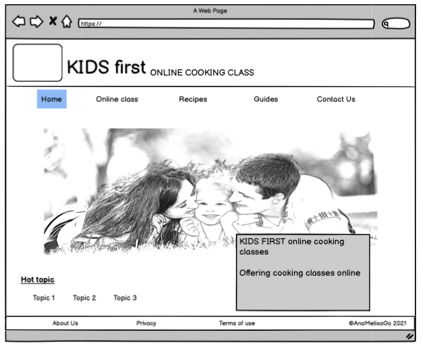

 
 

# Screenshots and Features

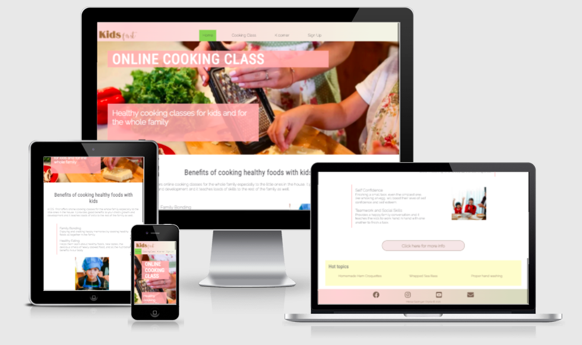

 
 

## Homepage

https://user-images.githubusercontent.com/86141994/141697283-388756d7-d2ac-40ee-92c5-8cb550cd1094.mov

 

### Navigation Bar
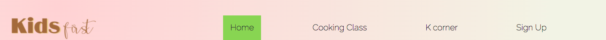

 

__Logo__

 
It's the name of the online cooking class. When clicked it brings back to the home page.

The navigation bar has four menus:
 

- __Home:__ takes you to home page.
- __Cooking class:__ Shows the timetables and how each class is organized.
- __K corner:__ Extra content for kids and the family as well.
    - Recipes
    - Tips
- __Sign up__

The current page on the screen is highlighted with a light green color on the navigation bar.

 

### Benefit of Cooking with Kids

In this section, I explain the benefits that cooking can bring to all kids. Cooking is not just making food. Cooking can teach the children the ability to read, to count, to write, can even boost their confidence, social skills, and to be organized, and most especially they learn to eat healthily, the advantage of a healthy diet and to be clean all the time.

 

### HOT TOPICS

I added an extra section on the home page where I listed some interesting topics and recipes that can be helpful for everyone.

 

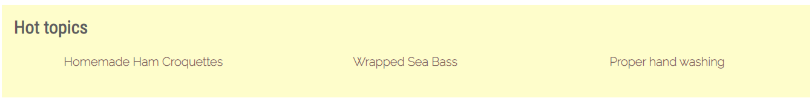

 

## Cooking class

Each class has a different time and a different meal so that all the recipes change each class. I made this part in small chunks for easy reading. I explained briefly how each class is organized.

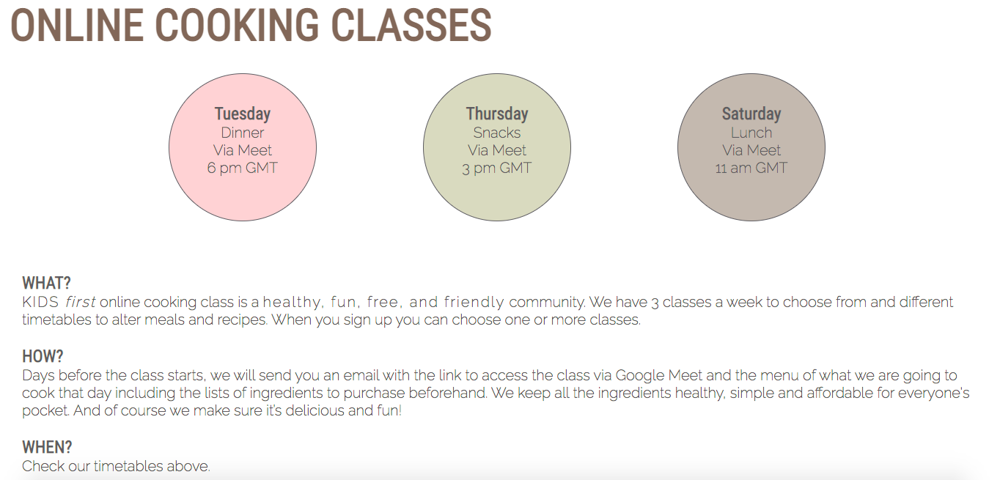

 

## K Corner

__K Corner__ stands for Kids first corner. This section is where I added the extra content of my project. It provides some helpful guides in cooking. It splits into two parts: RECIPES and TIPS.

 

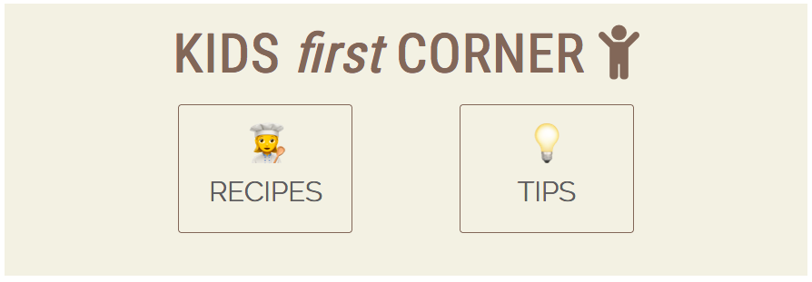

 

When any of these two buttons is clicked, it is highlighted with a light pink background and a little bit of a shadow. And the other one changes the text color into gray to make it more obvious that it's not the one selected.

 

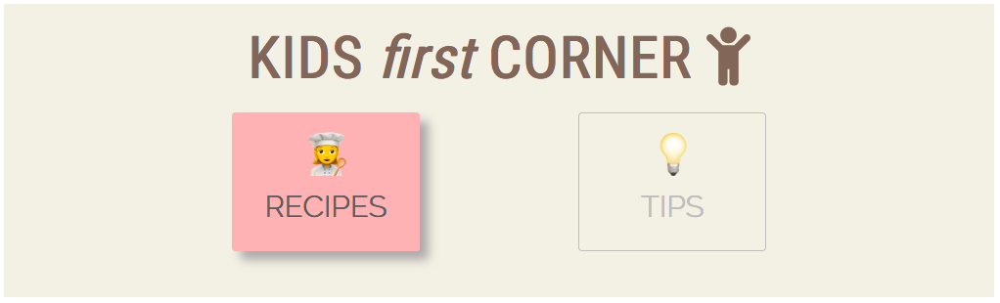

 

### Recipes

In this section, I put some cool recipes that can help families in making delicious and healthy meals for their kids. I added some healthy facts too about the main ingredient of the recipe. I added a button to click for an easy access to the navigation bar. It's a light green button that says "Top".

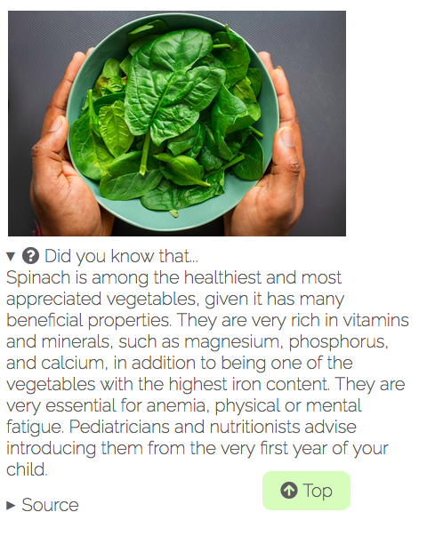

 

### Tips
This section is all about guidelines for the whole family, centered mostly on children, for example the proper way of handwashing.

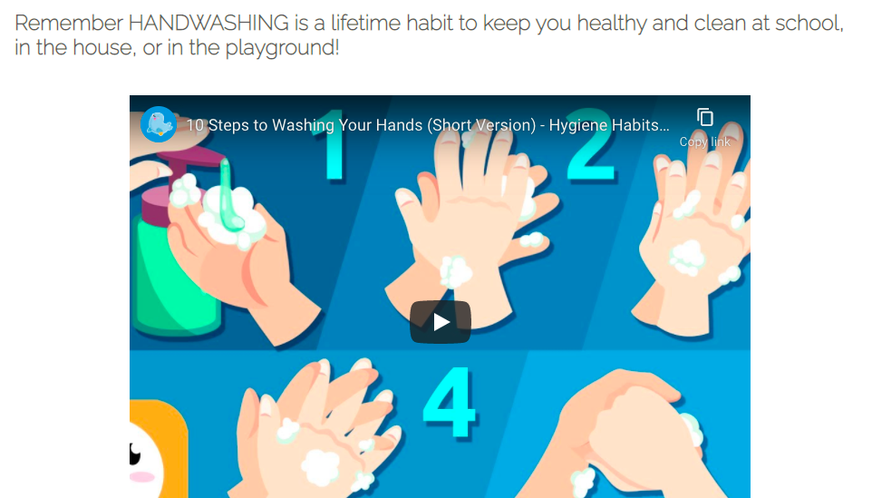

 

## Sign Up page
This page is where interested families can sign up for the online cooking classes. The form is simple with a little touch of an attractive background to indicate the purpose. All data asked are required for identification and future communication. Families should select the day or days they want to participate to group them and organize the cooking sessions.

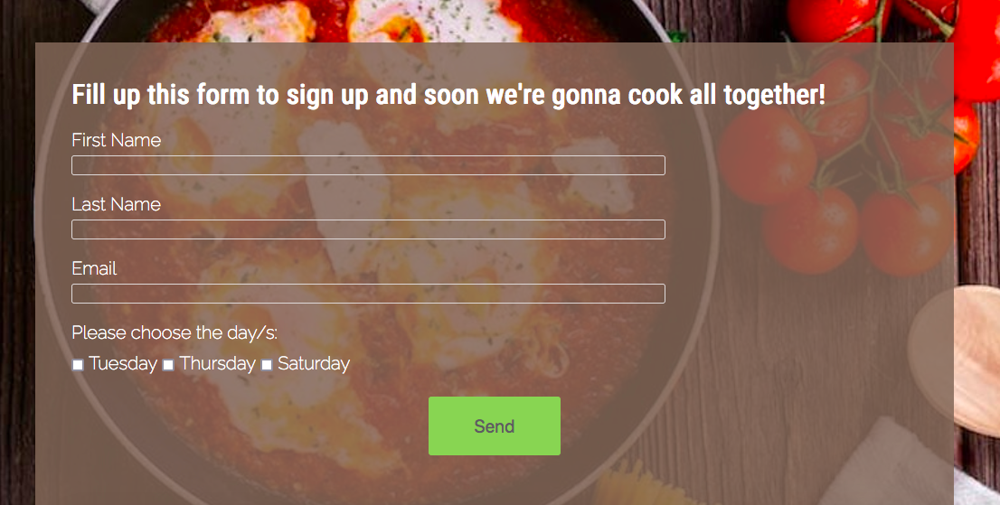

 

## Footer
The footer is where all the social media networks lie. When the mouse pointer is on top of the icon it changes to a light green color to match the color scheme of the page. I also added an icon to contact us. I added my name too, as the creator of this website.

 

### Contact Us
It's a page where parents or anyone can send any questions, comments or suggestions. It helps in solving any doubts, or including any new content they suggest like a new recipe, new tips or anything about the website’s improvement.

 

# The Final Result

## Deployment

I deployed this website to Github.

 

### Steps to deploy a repository to Github

1. Open the repository.
2. Go to settings from the menu just under the repository name.
3. On the left hand side of the settings, click Pages.
4. In the source section, select from the dropdown menu the branch option "main".
5. Save it by clicking the save button.
6. Once it's done, Github provides a link to open the site in a browser.

 

## Testing

- I deployed my website and tested it several times on different browsers, and it's working perfectly fine. I even tested on another display like the tv or another monitor.
    - Google Chrome
    - Mozilla Firefox
    - Safari

- All links open on another tab when clicked. The navigation bar, footer, and all the images are showing well. I also tested all the buttons if the url works and they all show the section of the webpage intended to go to.

- The form for Signing up is tested. The inputs requires a certain value. The google form of Contact Us page of the website is working as well.

- I tested the responsive layout on different devices, lengths, and widths. Everything is working smoothly.
    - Samsung Galaxy S10
    - Samsung Galaxy S20
    - Samsung Galaxy S5
    - Iphone X
    - Iphone 12
    - Iphone 5S
    - Ipad / Ipad mini
    - 4K Ultra HD Television

 

## Validator testing

- No errors found when tested in the official W3C HTML Validator.

- No errors found when tested in the official W3C CSS Validator (Jigsaw).

    

    
    

 

## Accesibility
I run the Lighthouse in the dev tools and this is the final result.

 

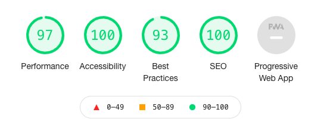

 

## Bugs and Fixes

- Centering with `margin: 0 auto;` was not working for me in the beginning. Instead, I used relative/ absolute positioning to almost every element of the website, like the positioning of the "More info" button from the home page . But when testing it on other devices (responsive layout), it wasn't working well. I found out that setting the display into `block` and setting the `width` too, that is when `margin: 0 auto` works fine.

- I notice a white gap in between the navigation bar and the image of Online class page. I fix it by resizing the "KIDS first" logo. It was pushing the image downwards.

- When I deployed my webpage for the first time with my mentor, we found out all the images were broken. I was using absolute file path by putting a slash at the beginning of each url link. I fixed every image link right away.

- When trying to open all the pages and their responsiveness, I found out that the footer of some of the HTML files in my project was not fixed at the bottom of the screen since it does not have enough content to push it downwards, like the kcorner.html and signup.html. I tried the `position: fixed`, `bottom: 0`, with `@media query and (min-height of 800px)`. But then it wasn't working well in other devices because it stays fixed at the bottom and in some devices it covers the content of the page. So I had to go back to my notes where I found the best solution. I changed the layout style by setting the height of the div container according to viewport height (vh) instead of using pixels (px).

- The only way I found out for the footer to display the icons next to each other and center them with `margin: 0 auto` was displaying them with flex. I tried `display: inline-block` but it wasn’t working at all.

- I tried the sign up form in different devices and I found out that it overflows in small devices, especially when rotating the device. I fixed it by setting `overflow: scroll`.

- When I run the HTML validator test I found out that button and anchor cannot be nested inside of each other. I had to change my layout and styles. I managed to bring it back as it were before. We learn from our mistakes.

- When I tested the lighthouse for the first time, the accesibility score was so low. The report says that the foreground and contrast color doesn't match and a mismatch in aria. I managed to bring up the score by changing the colors according to the contrast suggestions, and to deactivate an extension that was messing up with the lighthouse report.

- I fixed minor issues in the resolution of the images. I was able to tackle all of that I was aware of.

 

## Bugs Unfixed
No bugs were left unfixed.

 

## Notes and Future features

I added the Contact Us page at the last minute. It looked as though the website was lacking a part where anyone or interested families could ask questions or give some feedback. I could have used the text area element but I want to demonstrate that I can use another way of creating forms like the Google form. It's easier to build and I already made more forms like this in the past. I want to showcase my knowledge in Excel too, since google form is linked into a google sheet to record all the users' responses. I use google sheets in my daily basis, especially at work.

I couldn't style the home page just as I wanted, especially the "Benefits of cooking with kids" section. The positioning was messing with the contents a lot and solving the problem was consuming all the time I had in finishing the project. If I had more time maybe I could have come up with a better solution. But I’m happy with how it came out in the end.

I'm aware that I used a lot of code to style the header. I tried to change it but time was ticking fast. When I got more time and experience I will repair it to make it easier to code and read.
 
I created a separate file for testing my codes. I put the content and style it in that file, then I copy the code to the original project file. I don't know if it's a good or bad idea. At first, I thought it's the best way for me to practice coding and to test the code with dev tools without messing up the real project. But then it took me long hours before I complete a small section. So when I got used to Gitpod and into coding my ideas, I code and edit from the project file itself.

I'm happy with the outcome. But I'm open to comments and collaborations to improve my project and also to help me grow more as a developer. We can sometimes fall, but we try to stand tall hand in hand.

 

## Technology

- This project is written in HTML and CSS.
- Gitpod is used as editor and for version control.
- Hosted on Github.

 

# Credits

I want to thank all these people, sites and applications that helped me build a very exciting, fruitful website. 

## Media

### Photos
- [Pexels](https://www.pexels.com/ "A site for free photos and videos")
    - Rodnae production: A mom and a child grating cheese (main image), a pretty girl eating pasta, kids washing their hands.
    - Angela Roma: Happy kids making gyozas.
    - Dana Tentis: A kitchen table with frying pan, tomatoes, spoon and pasta (sign up photo).
    - Kampus production: Three kids baking in the kitchen.
    - SHVETS: Fresh fishes.
    - Louis Hanse: Bowl of spinach.
    - Charlotte May: A glass and a bottle of milk.

 

- [Unsplash](https://unsplash.com/ "Free usable images")
    - Bakd&Raw by Karolin Baitinger: Pasta salad photo.

 

- [Center of Disease Control and Prevention (CDC)](https://www.cdc.gov/):
    - Handwashing photo

 

- [Parenting Healthy Babies](https://parentinghealthybabies.com/ "A website to guide parents during pregnancy, childbirth, and parenting"):
    - Food pyramid for healthy toddlers photo

 

### Videos

- Youtube
    - Smile and Learn: [10 steps to wash your hands](https://youtu.be/Br4sQmiJ1jU)

 

## Content

- __Recipes__ and __Kids balance diet and food can cure__:
    - “Recetas para bebes y niños: del 1 al 5 años" *(Recipes for babies and children: from 1 to 5 years old)*
         
        Mi bebe y yo
         
        Sfera Editores España, S.L.U

- __Benefit of cooking with kids__:
    - https://www.teambuildingwithtaste.com/why-family-cooking-together-matters/
    - https://mommyuniversitynj.com/2015/03/16/10-benefits-of-cooking-with-kids/

- __Handwashing__:
    - [Center of Disease Control and Prevention (CDC): Handwashing](https://www.cdc.gov/handwashing/handwashing-family.html)

- __Milk benefit__
    - [Healthline](https://www.healthline.com/nutrition/milk-benefits#TOC_TITLE_HDR_8)

- __Ham croquettes__ (Croquetas de jamon)
    - [Pequerecetas](https://www.pequerecetas.com/receta/croquetas-de-jamon/)

 

## Codes and tutorials

- [SheCodes.io](https://www.shecodes.io/)

    My interest in coding started way back in high school. But I took another course and now I want to shift into the tech world. I started my tech journey with SheCodes before I went to Code Institute. I learned some basic knowledge of HTML, CSS, and Javascript with their basic workshop. They provided their students with some dev tools to use, such as CSS color palettes, color gradients, and much more. It's where I took the color gradient for this project's header and footer.

- Love Running

    I used as a guide some of the codes I learned during the development of the Love Running website. I even used the url provided here for the action attribute of my project's sign up form.

- [MDN WEB DOCS](https://developer.mozilla.org/en-US/)

- [W3 SCHOOLS](https://www.w3schools.com/)

- [STACK OVERFLOW](https://stackoverflow.com/)

 

During all these years of working with Google Drive and using Google Sheets, I got used to searching everything on the internet. Here are the codes that helped me a lot in this project from other developers.

- To crop image using CSS: By Alligator.io
    
    https://www.digitalocean.com/community/tutorials/css-cropping-images-object-fit

- How to link a section of a page to another page using id 

    https://stackoverflow.com/questions/20565644/how-to-link-to-a-div-on-another-page

- To center an image in md files

    https://stackoverflow.com/questions/12090472/how-do-i-center-an-image-in-the-readme-md-file-on-github

- To add empty space in md files

    https://stackoverflow.com/questions/44810511/how-to-add-empty-spaces-into-md-markdown-readme-on-github

- Add video to md files

    https://stackoverflow.com/questions/4279611/how-to-embed-a-video-into-github-readme-md

- [Website Color Schemes](https://visme.co/blog/website-color-schemes/): it's where I took  the color scheme of this project.

 

## Software / App used

- Phone built-in photo editor: to crop large images to use it easily.

- LogoMaker app: it's a phone app for free to create logos without a background.

- Balsamiq Wireframes.

- Google form: to build the "Contact Us" form.

- Google doc: to document all my thoughts and research with or without my computer (especially in between my working hours). I easily access my files using my phone.

- Quicktime player: to record the screen of my home page for this project's README.

- [Grammarly](https://app.grammarly.com/): for grammar and spelling checks.

- Google translate: to translate some content from the recipe book that I have in my house to english.

- <a href="https://www.online-convert.com/" target="_blank">Online Convert</a>: To convert images into webp format.
