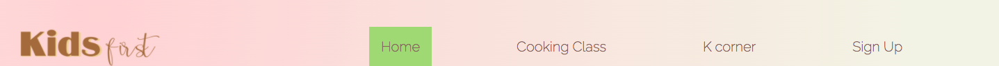
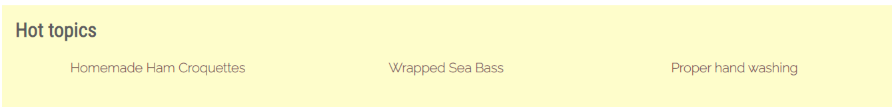
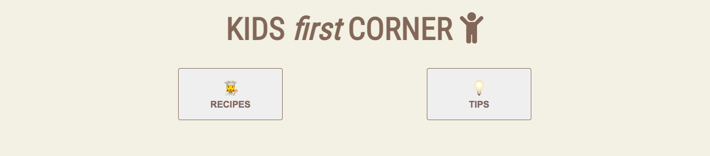
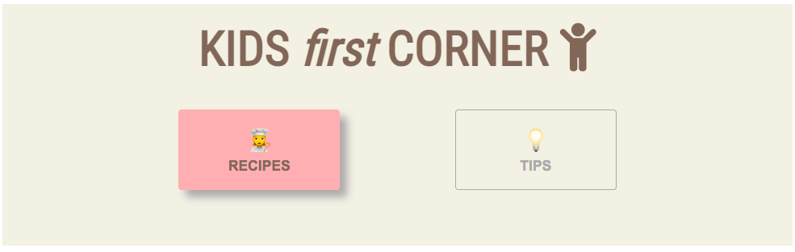
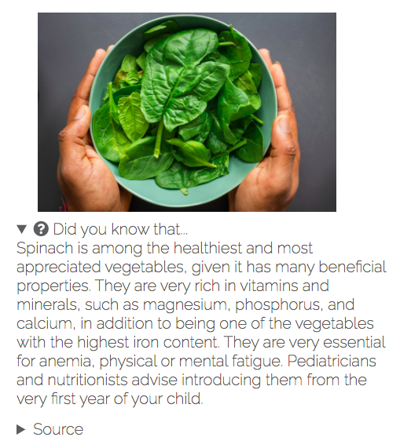
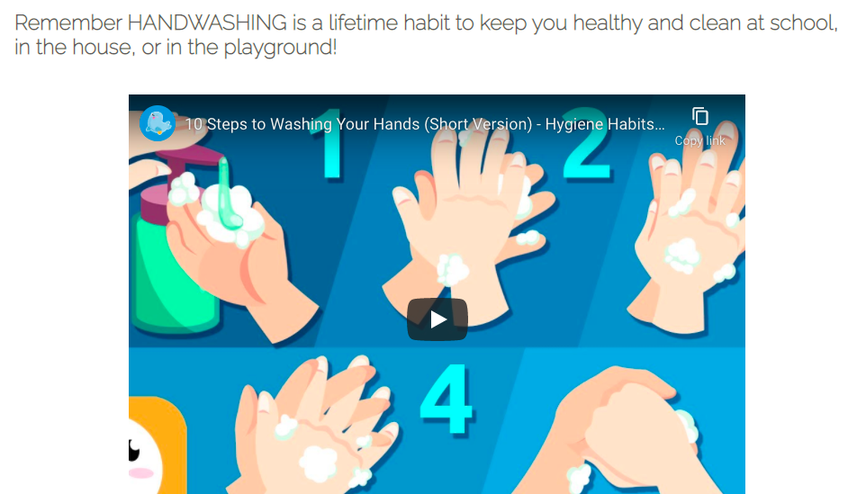
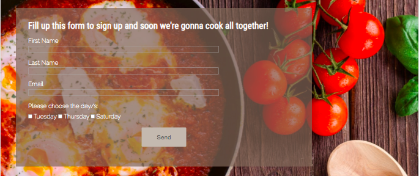

# Online Cooking Class
Created especially for the little ones in the house, and of course, for the whole family. It's healthy, free, fun, and friendly.
 
 
 

## Introduction
__KIDS *first*__ offer healthy online cooking classes aimed to teach basic cooking techniques to the little ones at home and of course to the whole family as well.

Cooking is an art. It's a daily house choir that can be learned by doing. Teaching the art of cooking from an early age with the help of these online cooking classes can promote creativity, a healthy and nutritious diet, cleanliness, self-confidence, and all other good benefits that cooking can bring to the whole family, especially to the kids in the house.

Good family bonding can be achieved by implicating everyone to do something and finish them happily to create happy memories. But sometimes parents are so loaded with work and stuff that family bonding and sometimes family gathering is forgotten. So __KIDS *first*__ is designed online to unite everyone in the house without going outside. It’s also free of charge so parents don’t need to worry about monthly payments or maintenance. The only penny you need to spend is in buying good kitchen tools for the children’s safety and all the healthy ingredients of the recipes we send via email prior to the cooking classes.

Cooking in our very own cozy little kitchen all together with our kids, helping each other to finish a nice good meal, and also cooking and sharing tips with other families from their own kitchen is fun, beneficial, and healthy. It’s the best way to spend time with the family and to enjoy a nice healthy meal created by everyone.
 

## Origin
My first idea for my first portfolio project was a history webpage just as the assessment guide suggested, which I thought was easier. It’s about __Vikings__ and their history.

 

When I talked to my mentor, he advised me it’s better to come up with an original idea, but the history project is a good one too. My mind was enlightened, so I changed the idea to a __Health guide for kids__ webpage. But then, these two ideas are very difficult ones because it has a lot of content, it could take a lot of searching, that can consume all the time I have, which I could spend it in coding instead. I even designed a logo for it but I didn't use it.

 
 

After giving it a lot of thought, finally I come up with the best one for my project. I found some books in my house that I purchased when my child was born. It’s a series of recipe books for 6-month-old babies up to 5-year-old toddlers. And that’s how I came up with the __Online cooking with kids__ website. I want to show and promote cooking healthy food with kids and to teach them the basics of cooking. It's easier to build. I also kept the website’s name "__KIDS *first*__" and I added the recipes from the recipe books and some tips too for the kids as an extra to make the webpage more dynamic and engaging. As an example, my child loves the handwashing video I put. Ever since we watch it, she always remembers the video every time she washes her hands. So I made a wireframe using Balsamiq to sketch some of my ideas and it served as a guide in shaping the website.
 

 
 

# Screenshots and Features

 
 

## Homepage

https://user-images.githubusercontent.com/86141994/141697283-388756d7-d2ac-40ee-92c5-8cb550cd1094.mov

 

### Navigation Bar

 

__Logo__

 
It's the name of the online cooking class. When clicked it brings back to the home page.

The navigation bar has four menus:
 

- __Home:__ takes you to home page.
- __Cooking class:__ Shows the timetables and how each class is organized.
- __K corner:__ Extra content for kids and the family as well.
    - Recipes
    - Tips
- __Sign up__

The current page on the screen is highlighted with a light green color on the navigation bar.

 

### Benefit of Cooking with Kids

In this section, I explain the benefits that cooking can bring to all kids. Cooking is not just making food. Cooking can teach the children the ability to read, to count, to write, can even boost their confidence, social skills, and to be organized, and most especially they learn to eat healthily, the advantage of a healthy diet and to be clean all the time.

 

### HOT TOPICS

I added an extra section on the home page where I listed some interesting topics and recipes that can be helpful for everyone.

 

 

## Cooking class

Each class has a different time and a different meal so that all the recipes change each class. I made this part in small chunks for easy reading. I explained briefly how each class is organized.

 

## K Corner

__K Corner__ stands for Kids first corner. This section is where I added the extra content of my project. It provides some helpful guides in cooking. It splits into two parts: RECIPES and TIPS.

 

 

When any of these two buttons is clicked, it is highlighted with a light pink background and a little bit of a shadow. And the other one changes the text color into gray to make it more obvious that it's not the one selected.

 

 

### Recipes

In this section, I put some cool recipes that can help families in making delicious and healthy meals for their kids. I added some healthy facts too about the main ingredient of the recipe. 

 

### Tips
This section is all about guidelines for the whole family, centered mostly on children, for example the proper way of handwashing.

 

## Sign Up page
This page is where interested families can sign up for the online cooking classes. The form is simple with a little touch of an attractive background to indicate the purpose. All data asked are required for identification and future communication. Families should select the day or days they want to participate to group them and organize the cooking sessions.

 

## Footer
The footer is where all the social media networks lie. When the mouse pointer is on top of the icon it changes to a light green color to match the color scheme of the page. I also added an icon to contact us. I added my name too, as the author and creator of the website.

 

### Contact Us
It's a page where parents or anyone can send any questions, comments or suggestions. It helps in solving any doubts, or including any new content they suggest like a new recipe, new tips or anything about the website’s improvement.

 
 

# Credits

I want to thank all these people and all these sites and applications who helped me build a very exciting, fruitful website. 

## Media

### Photos
- [Pexels](https://www.pexels.com/ "A site for free photos and videos")
    - Rodnae production: A mom and a child grating cheese (main image), a pretty girl eating pasta, kids washing their hands.
    - Angela Roma: Happy kids making gyozas.
    - Dana Tentis: A kitchen table with frying pan, tomatoes, spoon and pasta (sign up photo).
    - Kampus production: Three kids baking in the kitchen.
    - SHVETS: Fresh fishes.
    - Louis Hanse: Bowl of spinach.
    - Charlotte May: A glass and a bottle of milk.

 

- [Unsplash](https://unsplash.com/ "Free usable images")
    - Bakd&Raw by Karolin Baitinger: Pasta salad photo.

 

- [Center of Disease Control and Prevention (CDC)](https://www.cdc.gov/):
    - Handwashing photo

 

- [Parenting Healthy Babies](https://parentinghealthybabies.com/ "A website to guide parents during pregnancy, childbirth, and parenting"):
    - Food pyramid for healthy toddlers photo

 

### Videos

- Youtube
    - Smile and Learn: [10 steps to wash your hands](https://youtu.be/Br4sQmiJ1jU)

 

## Content

- __Recipes__ and __Kids balance diet and food can cure__:
    - “Recetas para bebes y niños: del 1 al 5 años" *(Recipes for babies and children: from 1 to 5 years old)*
         
        Mi bebe y yo
         
        Sfera Editores España, S.L.U

 

- __Benefit of cooking with kids__:
    - https://www.teambuildingwithtaste.com/why-family-cooking-together-matters/
    - https://mommyuniversitynj.com/2015/03/16/10-benefits-of-cooking-with-kids/

 

- __Handwashing__:
    - [Center of Disease Control and Prevention (CDC): Handwashing](https://www.cdc.gov/handwashing/handwashing-family.html)

 

- __Milk benefit__
    - [Healthline](https://www.healthline.com/nutrition/milk-benefits#TOC_TITLE_HDR_8)

 

- __Ham croquettes__ (Croquetas de jamon)
    - [Pequerecetas](https://www.pequerecetas.com/receta/croquetas-de-jamon/)

 

## Codes

- [SheCodes](https://www.shecodes.io/)

    My interest in coding started way back in high school. But I took another course and now I want to shift into the tech world. I started my tech journey with SheCodes before I went to Code Institute. I learned some basic knowledge of HTML, CSS, and Javascript with their basic workshops. They provided their students with some dev tools to use, such as CSS color palettes, color gradients, and much more. It's where I took the color gradient for this project's header and footer.

- Love Running

    I used as a guide some of the codes I learned during the development of the Love Running website.

- [MDN WEB DOCS](https://developer.mozilla.org/en-US/)

- [W3 SCHOOLS](https://www.w3schools.com/)

- [STACK OVERFLOW](https://stackoverflow.com/)

- Slack

 

During all these years of working with Google Drive and using Google Sheets, I got used to searching everything on the internet. Here are the codes that helped me a lot in this project from other developers.

- To crop image using CSS: By Alligator.io
    
    https://www.digitalocean.com/community/tutorials/css-cropping-images-object-fit

- How to link a section of a page to another page using id 

    https://stackoverflow.com/questions/20565644/how-to-link-to-a-div-on-another-page

- Vertical align of flex elements
    
    https://stackoverflow.com/questions/5150411/align-divs-to-the-bottom-of-their-container

- To center an image in md files

    https://stackoverflow.com/questions/12090472/how-do-i-center-an-image-in-the-readme-md-file-on-github

- To add empty space in md files

    https://stackoverflow.com/questions/44810511/how-to-add-empty-spaces-into-md-markdown-readme-on-github

- Add video to md files

    https://stackoverflow.com/questions/4279611/how-to-embed-a-video-into-github-readme-md

- [Website Color Schemes](https://visme.co/blog/website-color-schemes/): it's where I took  the color scheme of this project.

 

## Software / App

- Phone built-in photo editor: to crop large images to use it easily.

- LogoMaker app: it's a phone app for free to create logos without a background.

- Google form: for contact us form.

- Google doc: to document all my thoughts and research with or without my computer (especially during working hours). I can access my files using my phone.

- Quicktime player: to record the screen of my home page for this project's README.

- [Grammarly](https://app.grammarly.com/): for grammar and spelling checks.

- Google translate: to translate some content from the book recipe that I have to english.

 

# Technology

This project was written in HTML and CSS. It is hosted on Github.

 

# Testing

- I tested on different browsers like Google Chrome, Mozilla Firefox, and Safari
