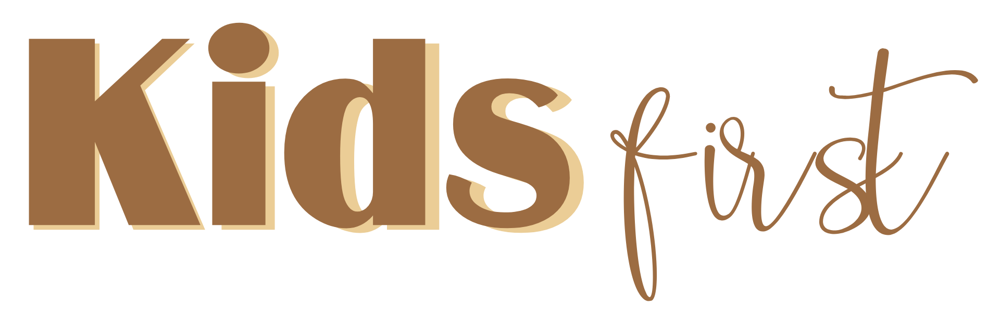
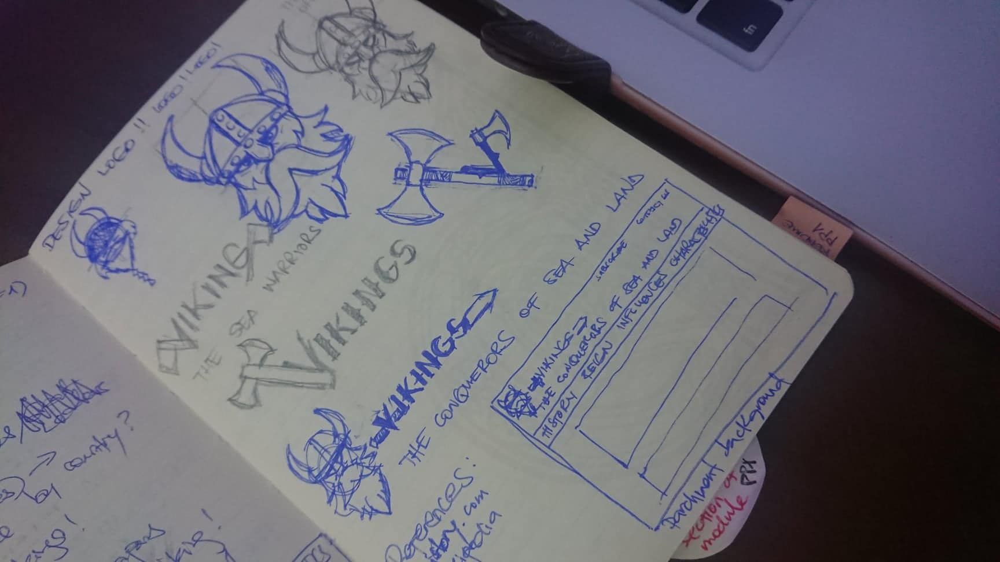
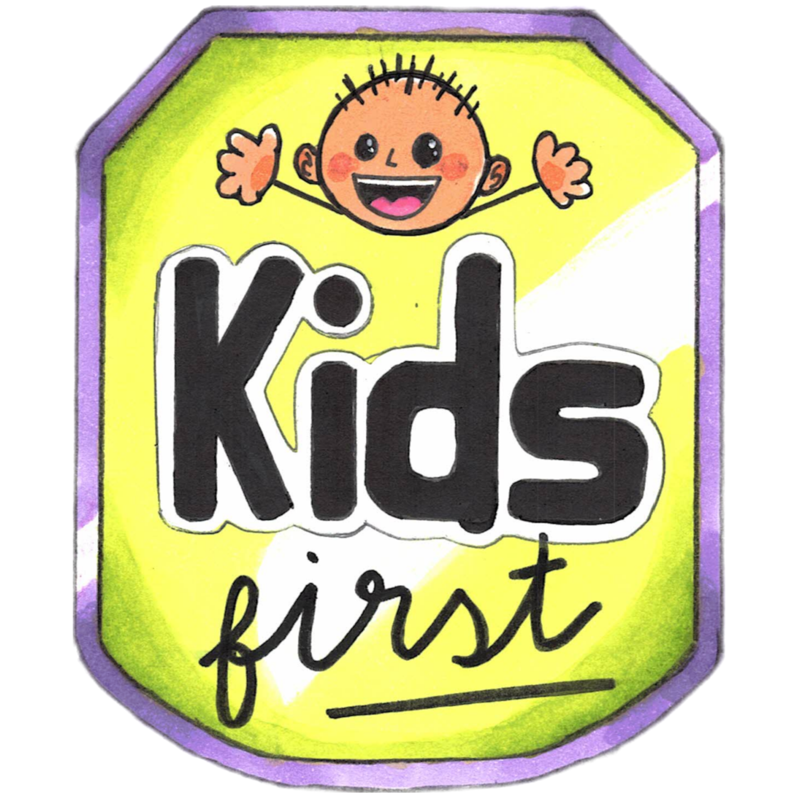
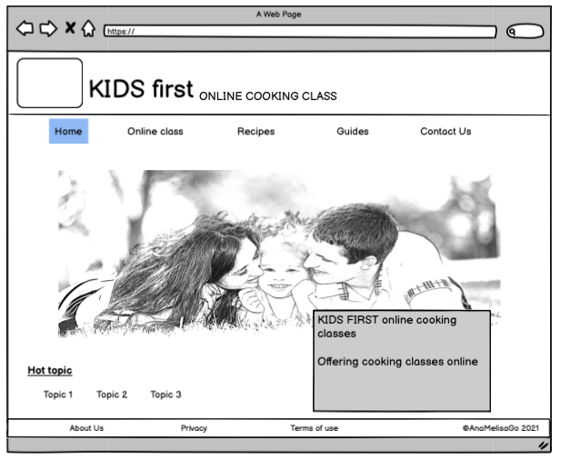
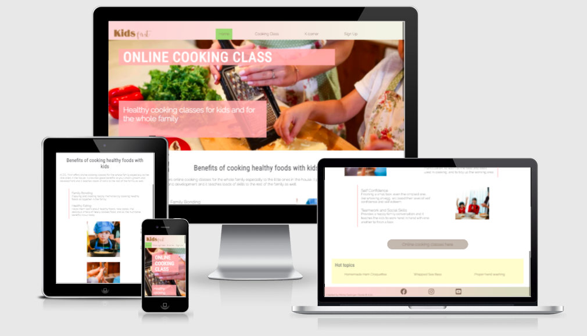

# ONLINE COOKING CLASSES
Created especially for the little ones in the house, and of course, for the whole family. It's healthy, free, fun, and friendly.
 
 
 

## INTRODUCTION
__KIDS *first*__ offer healthy online cooking classes aimed to teach basic cooking techniques to the little ones at home and of course to the whole family as well.

Cooking is an art. It's a daily house choir that can be learned by doing. Teaching the art of cooking from an early age with the help of these online cooking classes can promote creativity, a healthy and nutritious diet, cleanliness, self-confidence, and all other good benefits that cooking can bring to the whole family, especially to the kids in the house.

Good family bonding can be achieved by implicating everyone to do something and finish them happily to create happy memories. But sometimes parents are so loaded with work and stuff that family bonding and sometimes family gathering is forgotten. So __KIDS *first*__ is designed online to unite everyone in the house without going outside. It’s also free of charge so parents don’t need to worry about monthly payments or maintenance. The only penny you need to spend is in buying good kitchen tools for the children’s safety and all the healthy ingredients of the recipes we send via email prior to the cooking classes.

Cooking in our very own cozy little kitchen all together with our kids, helping each other to finish a nice good meal, and also cooking and sharing tips with other families from their own kitchen is fun, beneficial, and healthy. It’s the best way to spend time with the family and to enjoy a nice healthy meal created by everyone.
 

## ORIGIN
My first idea for my first portfolio project was a history webpage just as the assessment guide suggested, which I thought was easier. It’s about __Vikings__ and their history.

 

When I talked to my mentor, he advised me it’s better to come up with an original idea, but the history project is a good one too. My mind was enlightened, so I changed the idea to a __Health guide for kids__ webpage but then, it’s a very difficult one because it has a lot of content, it takes a lot of searching, including the first idea, that could consume all the time I have, rather than spending it in coding. I even designed a logo for it.

 
 

After giving it a lot of thought, finally I come up with the best one for my project. I found some books in my house that I purchased when my child was born. It’s a series of recipe books for 6-month-old babies up to 5-year-old toddlers. And that’s how I came up with the __Online cooking with kids__ website. I want to show and promote cooking healthy food with kids and to teach them the basics of cooking. It's easier to build. I kept the website’s name "__KIDS *first*__" and I added the recipes from the recipe books and some tips for the kids as an extra to make the webpage more dynamic and engaging. As an example, my child loves the handwashing video I put. Ever since we watched it, she always remember the video every time she washes her hands.
 

 
 

# SCREENSHOTS AND FEATURES

 
 

## HOMEPAGE
